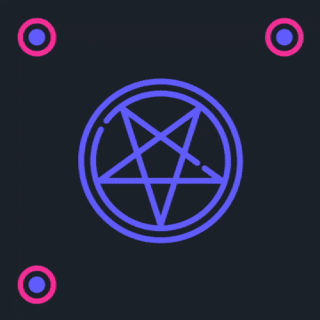

# Pentacoder 𖤐

*Pentacoder is a web app for creating pentacodes - circles of encoded data.*

Pentacode as a format is inherently web and punk. Initially it wasn't supposed to be used in any kind of real-life scenario or even be easily readable. We simply do what we must because we can. In other words, I really just wanted to make something that'd look cool and ultra Y2K, while being meaningful.

Initially it was a simple command line Python tool, but I wanted to make it more pleasant to use and more accessible in general. And so I rewrote it in TypeScript.

 

 

## Format description 📦

The encoding process is pretty simple, but it'll take a little bit of an explanation. The outermost circle is always a metadata circle, the other ones are the data circles.

Metadata circle consists of `16 bits` encoding message's byte length, `4 bits` encoding amount of circles and `2 bits` encoding spin value.

Data circles encoding is the following:
1) The input message gets transformed into UTF-8 binary.
2) Binary gets split into an even `n` amount of circles.
3) Binary length floor divided by `n` is `x`. Each circle takes `x` as a base length.
4) If binary length divided by `n` has a remainder `r`, the first `r` outermost data circles have a length of `x+1` to compensate for it.
5) Now for each circle we group its bits together by value. We iterate through those groups starting with the second one:
   1) Reduce group's length by one. If it becomes zero length, leave the next group as is and jump to the one after it. If it doesn't, go to the next group.
   2) Repeat until fully iterated.
6) The circles are drawn in order from outermost to innermost and spun clockwise by `spin`*`i`, where `i` is the current data circle id, starting with 1.
7) The gap between beginning of a data circle and its end might be meaningful, but might also be not. It depends on if the last bit of that circle was equal to the second to last one.

## Lore implications 🪶

> [!NOTE]
> Quick context: *Noelle Stern as a character is a cat-demon hybrid, living in Post Mortem, a place we, as humans, would usually call "Hell".*

**Pentacodes** are the go-to *2D barcode format* in **Post Mortem**. They are a derivative of the classic pentagrams overhauled to fit into modern society. You can find them on products, business cards, manuals, and even on video recordings - they're everywhere! Their engineering is beyond ingenious, since they're at the same time both easily demon-readable as well as machine-readable. Being based on something so fundamental to demon society has a ton benefits. They were trivial to integrate and it went so smoothly it took no time for everyone to get used to.